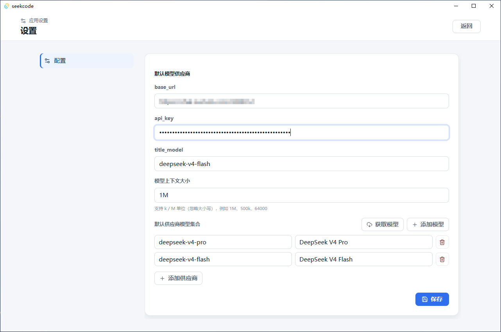
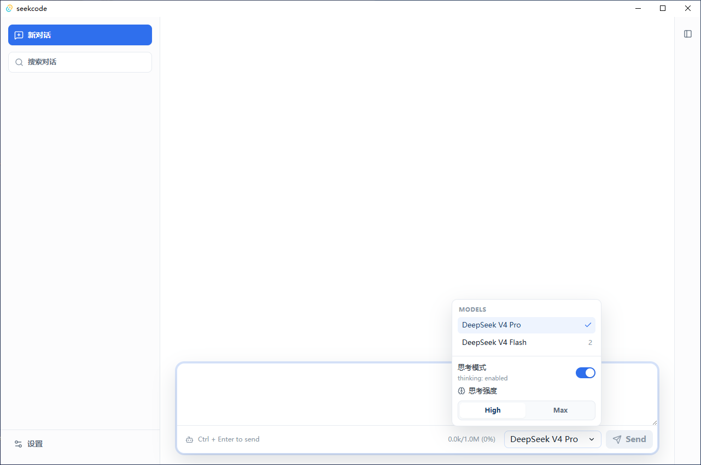
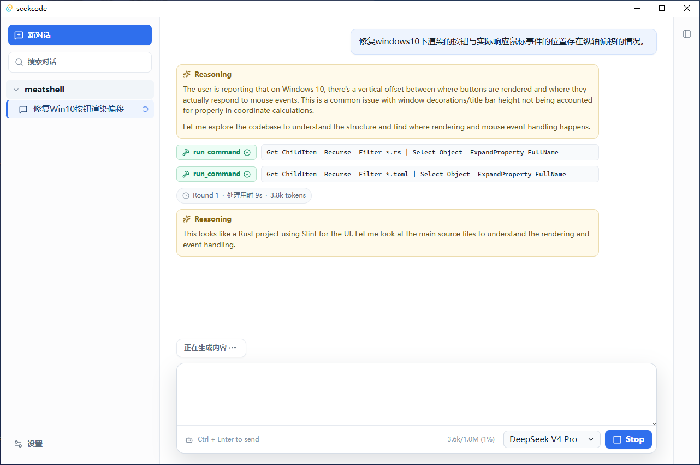
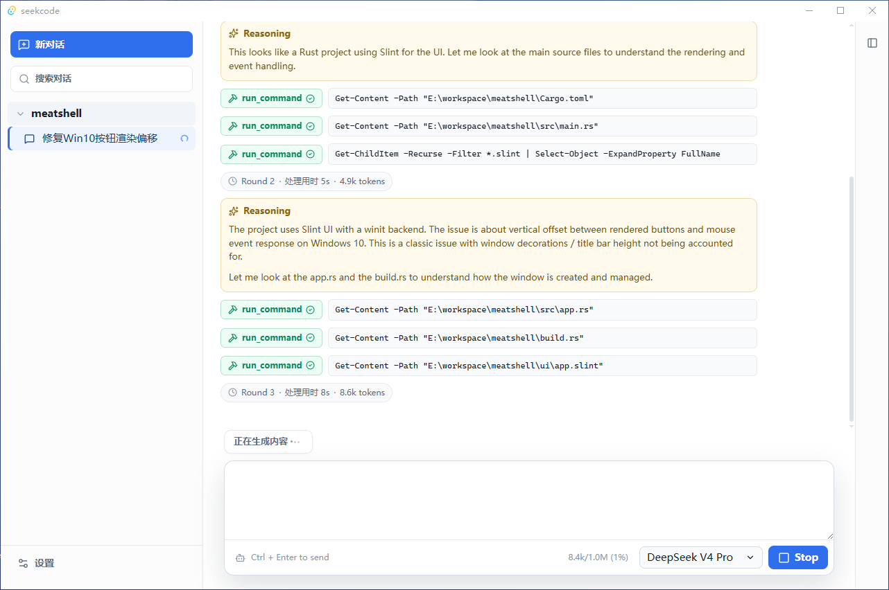
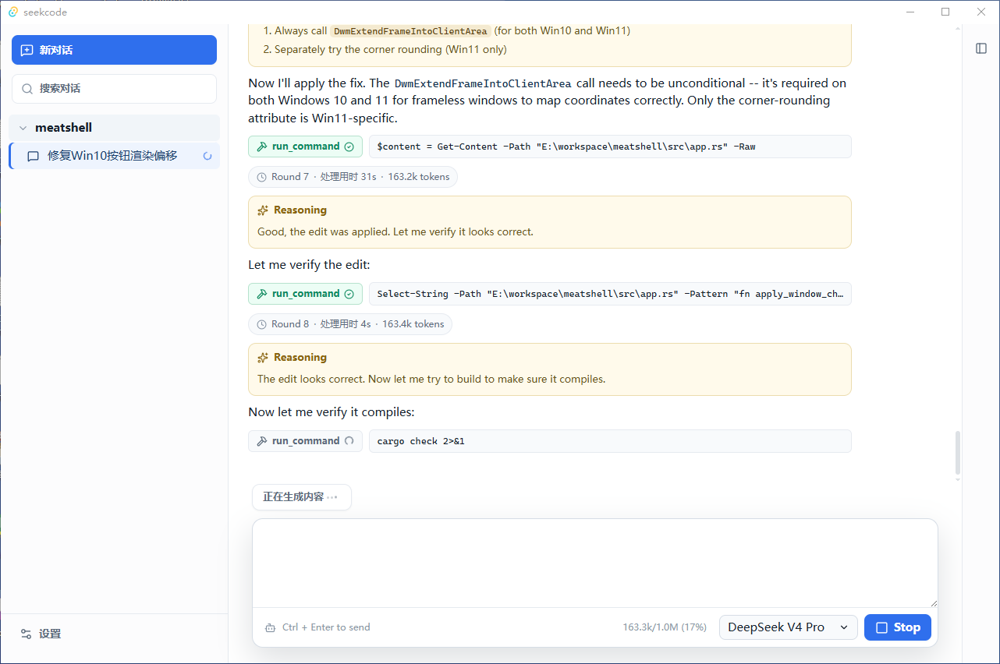
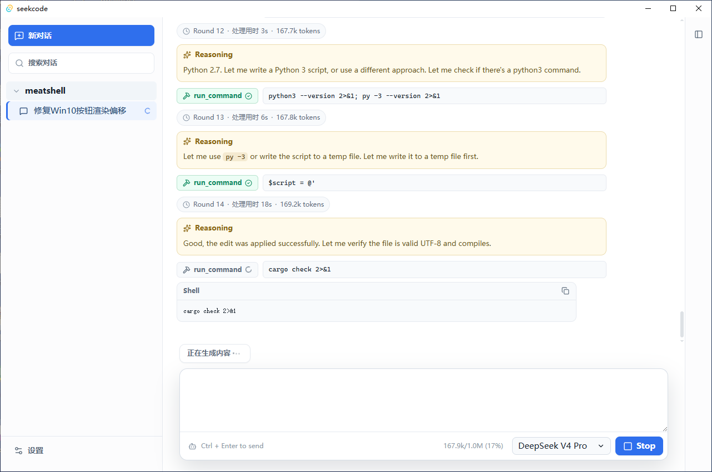
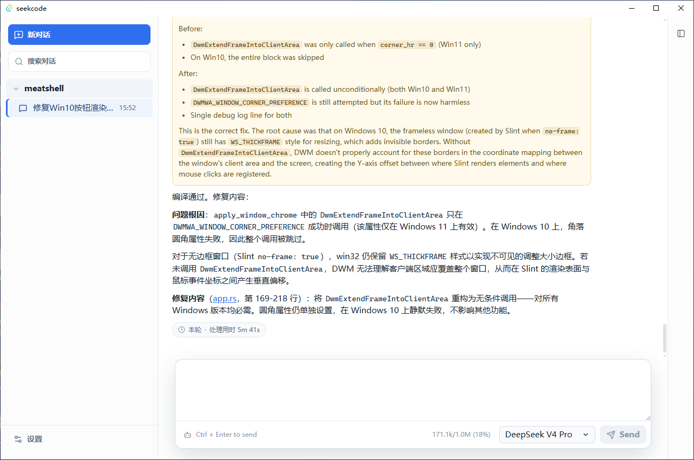

# SeekCode

SeekCode is a desktop coding assistant built with Tauri, React, and Rust. It
provides workspace-scoped AI chats, streaming reasoning/tool-call output,
persistent sessions, model-provider configuration, and local command execution
for coding workflows.

Chinese documentation is available in [README_zh.md](README_zh.md).

## Features

- Workspace and session management with SQLite persistence.
- Streaming assistant responses, reasoning output, and tool-call progress.
- DeepSeek by default, with support for additional OpenAI-compatible providers.
- Per-session model selection, thinking mode, and reasoning-effort controls.
- Context-window tracking and automatic context compaction for long sessions.
- Session statistics for model calls, tokens, cache hits, and elapsed time.
- Built-in `run_command` tool for non-interactive commands in the selected workspace.
- Local settings saved under the user's home directory.

## Tech Stack

- Frontend: React 19, Vite, Tauri JavaScript APIs, lucide-react.
- Desktop shell: Tauri 2.
- Backend: Rust workspace with async services on Tokio.
- Storage: SQLite through `sqlx`.
- Model client: DeepSeek/OpenAI-compatible chat completions API.

## Prerequisites

- Node.js and npm.
- Rust stable toolchain.
- Tauri 2 CLI:

```bash
cargo install tauri-cli --version "^2" --locked
```

Follow the official Tauri setup for your operating system if the native build
toolchain or WebView runtime is missing.

## Quick Start

Install JavaScript dependencies:

```bash
npm ci
```

Run the desktop app in development mode:

```bash
cargo tauri dev
```

Run the Vite frontend only:

```bash
npm run dev
```

The dev frontend is served at `http://127.0.0.1:1420`.

## Configuration

Open the in-app settings page to configure the default provider and optional
additional providers. Settings are persisted to:

- Windows: `%USERPROFILE%\.seekcode\config.toml`
- macOS/Linux: `$HOME/.seekcode/config.toml`

The default settings use DeepSeek:

```toml
base_url = "https://api.deepseek.com"
api_key = ""
title_model = "deepseek-v4-flash"
context_window = "1M"

[[models]]
id = "deepseek-v4-pro"
label = "DeepSeek V4 Pro"

[[models]]
id = "deepseek-v4-flash"
label = "DeepSeek V4 Flash"
```

Additional providers must expose OpenAI-compatible endpoints:

- `GET /models` for model discovery.
- `POST /chat/completions` for chat completions.

Conversation data is stored in:

- Windows: `%USERPROFILE%\.seekcode\seekcode.sqlite`
- macOS/Linux: `$HOME/.seekcode/seekcode.sqlite`

## Development Commands

```bash
# Frontend tests
npm test

# Rust tests
cargo test --workspace

# Build frontend assets
npm run build

# Build desktop bundles
cargo tauri build
```

On Windows, the release workflow builds NSIS and MSI installers with:

```bash
cargo tauri build --bundles nsis,msi
```

## Project Structure

```text
.
|-- src/                         # React UI
|   |-- components/              # UI components
|   |-- lib/                     # Frontend state and formatting helpers
|   `-- styles/                  # CSS modules by UI area
|-- src-tauri/                   # Tauri app, commands, config, logging
|-- crates/
|   |-- agent-core/              # Agent task lifecycle and runner
|   |-- app-kernel/              # Application service orchestration
|   |-- common/                  # Shared IDs, errors, DTOs, telemetry
|   |-- deepseek-client/         # DeepSeek/OpenAI-compatible model client
|   |-- storage/                 # SQLite storage layer and migrations
|   `-- tool-system/             # Tool registry and built-in system tools
|-- package.json                 # Frontend scripts and dependencies
`-- Cargo.toml                   # Rust workspace manifest
```

## Local Tool Safety

SeekCode exposes a `run_command` tool to the model. Commands run through the
platform shell with the selected workspace as the default working directory.
Review prompts and model behavior carefully before allowing destructive changes
to important files.

## Testing

The project includes both frontend unit tests and Rust crate tests:

```bash
npm test
cargo test --workspace
```

Run both before opening a pull request or shipping a local build.

## Exhibition








## License

SeekCode is licensed under the MIT License. See [LICENSE](LICENSE).
